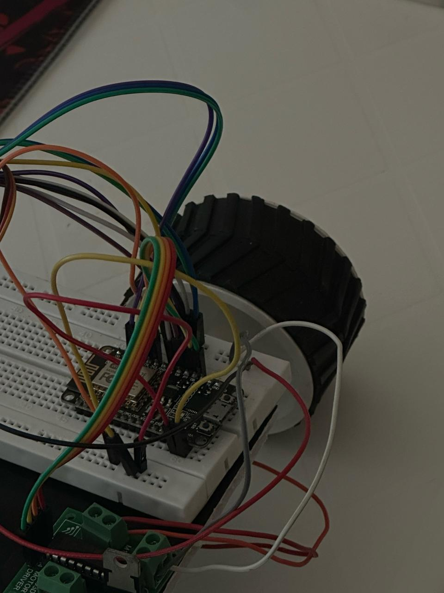
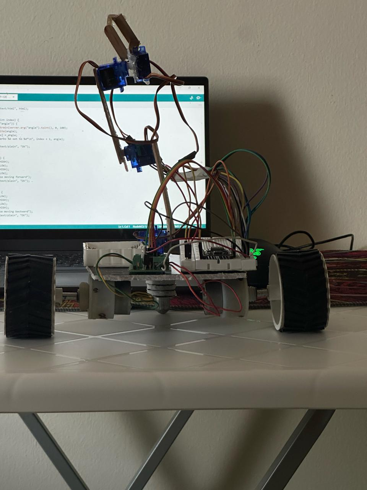
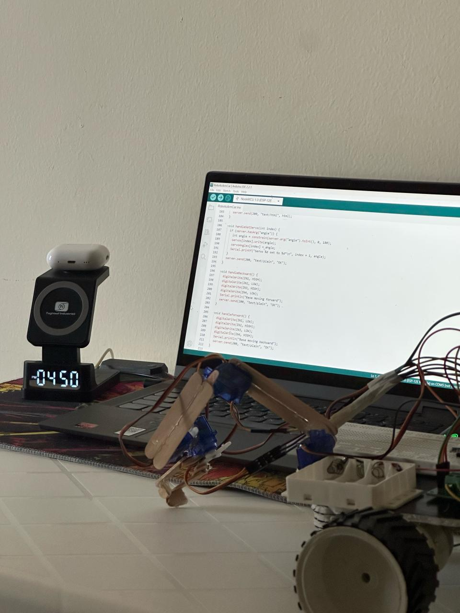
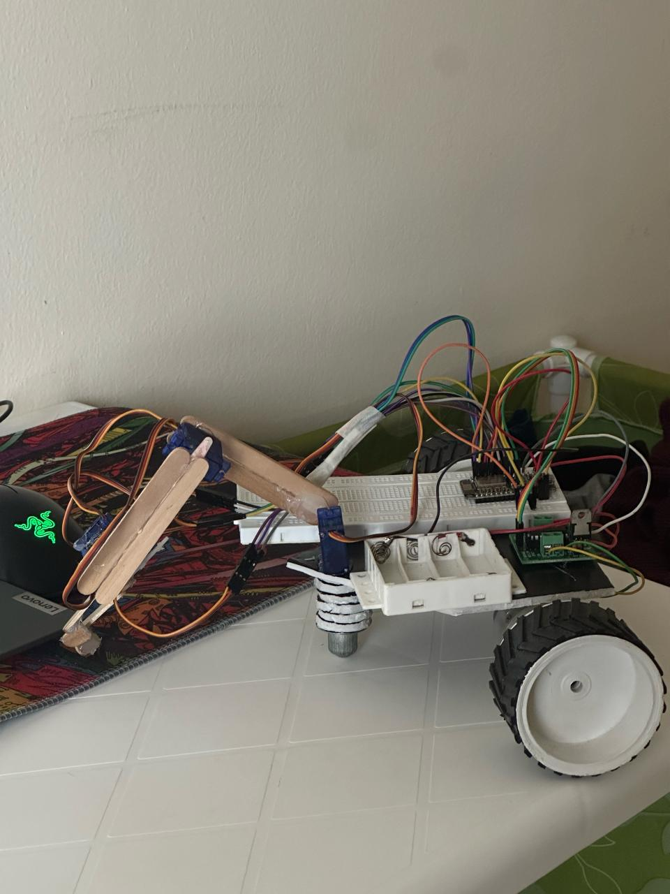

# DeskMate (Desk Cleaning Robot)
DeskMate is an ESP8266-based desk cleaning robot with robotic-arm and mobile base control through a built-in web interface.
## Features
- Hosts a local Wi-Fi access point for direct phone/laptop control
- 4-servo robotic arm control with live slider UI
- Base movement control using joystick-like web controls
- Lightweight HTTP endpoints for robot actions
## Hardware Stack
- ESP8266 microcontroller
- 4x servo motors (arm)
- Motor driver + DC motors (base)
- Chassis + cleaning attachment setup
## Firmware
- Main firmware file: `RoboticArmCar.ino`
## Project Gallery

## Setup
1. Open `RoboticArmCar.ino` in Arduino IDE.
2. Configure AP credentials in `APSSID` and `APPSK`.
3. Select ESP8266 board and upload firmware.
4. Connect to the AP and open the IP shown on serial monitor.
## API Endpoints
- `/setServo0` to `/setServo3` with `angle=<0-180>`
- `/forward`, `/backward`, `/left`, `/right`, `/stop`
